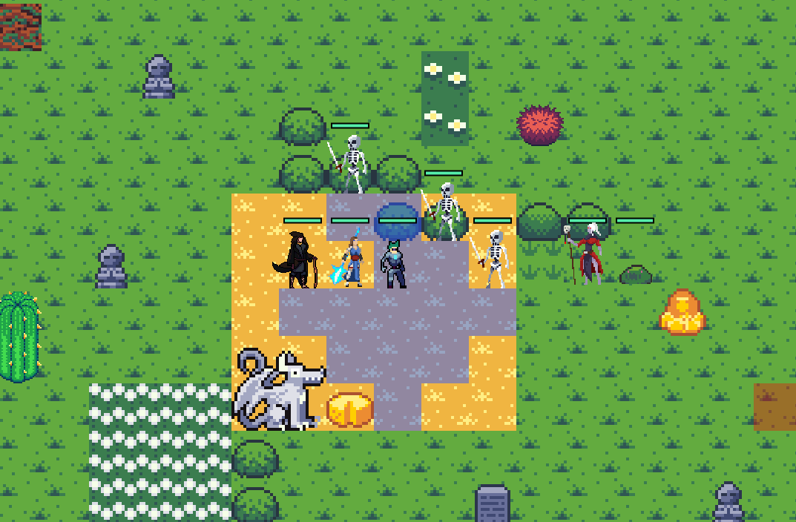
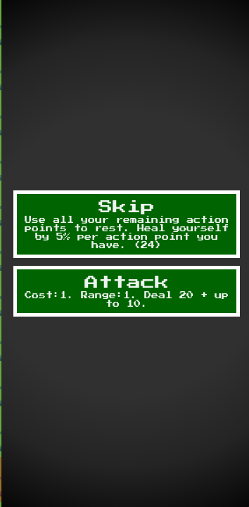

# Space War

## Proje Hakkında
Space War, JavaScript tabanlı, ızgara (grid) sistemi üzerinde çalışan sıra tabanlı bir strateji oyunudur. Proje, farklı yeteneklere sahip karakterlerin stratejik olarak konumlandırılması ve yönetilmesi esasına dayanır.

## Hedef ve Zorluklar (Challenge)
**Hedef:** Oyuncunun, kontrolündeki karakterlerin sınıf özelliklerini ve harita üzerindeki konumlarını optimize ederek tüm düşman birimlerini etkisiz hale getirmesidir.

**Zorluklar:**
*   **Stratejik Konumlanma:** Karakterlerin menzilli, yakın dövüş veya alan hasarı (AoE) yeteneklerinin, harita üzerindeki karelere (tile) göre doğru hesaplanması gerekmektedir. Düşman birimleri de oyuncuyla aynı yeteneklere sahip olduğundan, yanlış konumlandırma doğrudan birim kaybına yol açar.
*   **Sağlık (HP) ve Tur Yönetimi:** Tur bazlı sistemde agresif ve defansif oyun arasında denge kurulmalıdır. Oyuncu, saldırı veya hareket hamlesi yapmak yerine turu pas geçtiğinde, ilgili karakterin maksimum sağlığının %5'i oranında iyileşme sağlanır. Hasar takası ve iyileşme zamanlamasının doğru planlanması oyunun temel mekaniğini ve zorluğunu oluşturur.

## Kontroller
Oyun içi etkileşimler tamamen fare kontrolleri üzerinden gerçekleştirilir:
*   **Hareket:** Harita üzerinde karakterin gitmesi istenilen uygun kareye (tile) sol tıklanarak hareket işlemi gerçekleştirilir.
*   **Yetenek Kullanımı:** Ekranın sağ tarafında yer alan kullanıcı arayüzü (UI) panelinden uygulanmak istenen yetenek (Menzilli, Yakın Hasar, Alan Hasarı) seçilir. Ardından harita üzerinde hedeflenen alana tıklanarak eylem tamamlanır.
*   **Tur Atlama (Bekleme):** Sağ panel üzerinden eylem yapmadan sıra düşmana devredilebilir. Bu komut, belirtilen %5 can yenilenmesi işlevini tetikler.

## Karakter Sınıfları ve Savaş Mekanikleri
Oyun, farklı stratejik roller üstlenen karakter sınıflarını barındırır:
*   **Yakın Dövüş Birimleri:** Sadece bitişik (komşu) karelerdeki hedeflere saldırabilir, hasar potansiyelleri yüksektir.
*   **Menzilli Birimler:** Uzak mesafelerden tekil hedeflere güvenli hasar uygular.
*   **Alan Hasarı (AoE) Birimleri:** Belirli bir etki alanı içerisindeki birden fazla kareye eşzamanlı hasar vererek düşman gruplarına karşı avantaj sağlar.

## Oyun İçi Görüntüler


*Görsel 1: Izgara (grid) tabanlı savaş alanı ve birim dizilimleri.*


*Görsel 2: Sağ taraftaki kontrol paneli, yetenek seçimi ve turun uygulanması.*

## Kurulum ve Çalıştırma
Proje istemci tarafında (client-side) çalışacak şekilde tasarlanmıştır ve standart web teknolojileri (HTML, CSS, JavaScript) ile oluşturulmuştur.

1. Projeyi bilgisayarınıza indirin veya klonlayın:
   ```bash
   git clone https://github.com/MasterSacid/Space-war.git
   ```
2. Klonladığınız dizine gidin.
3. Herhangi bir derleyici veya paket yöneticisine (npm, yarn vb.) ihtiyaç duymadan, kök dizindeki `index.html` dosyasını güncel bir web tarayıcısında açarak oyunu doğrudan çalıştırabilirsiniz.
*(Not: Tarayıcı güvenlik politikaları gereği bazı JavaScript modülleri yerel dosya sisteminde çalışmazsa, projeyi VS Code "Live Server" eklentisi ile açmanız tavsiye edilir.)*
